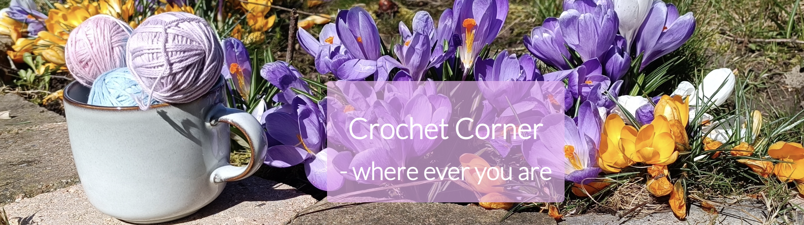
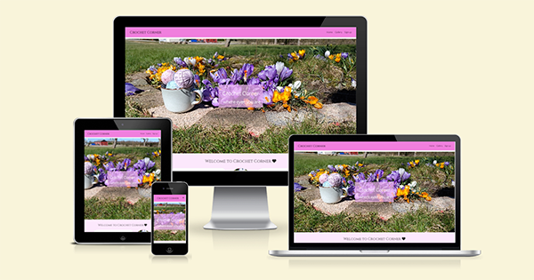
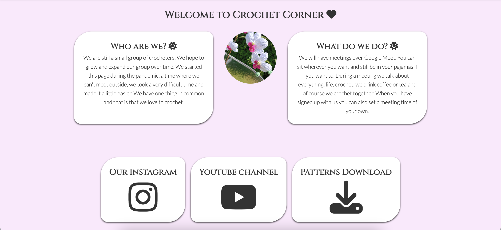
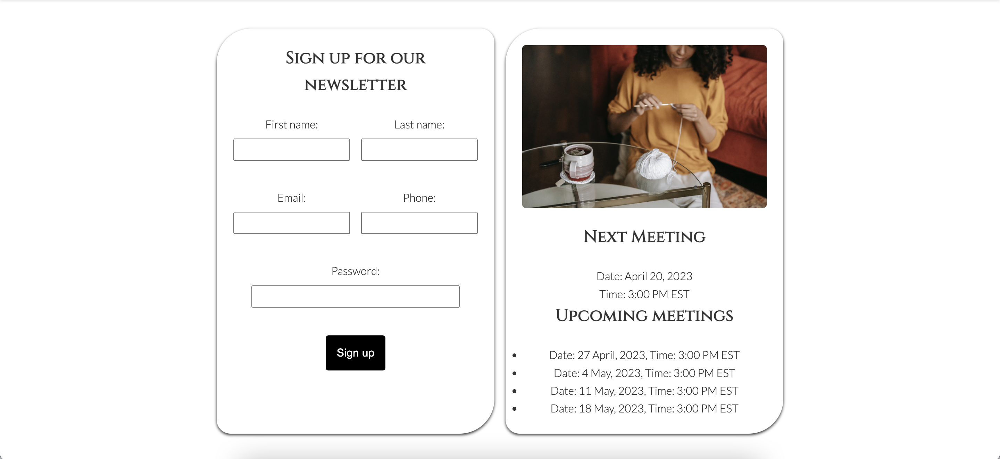
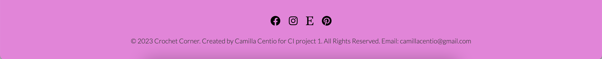
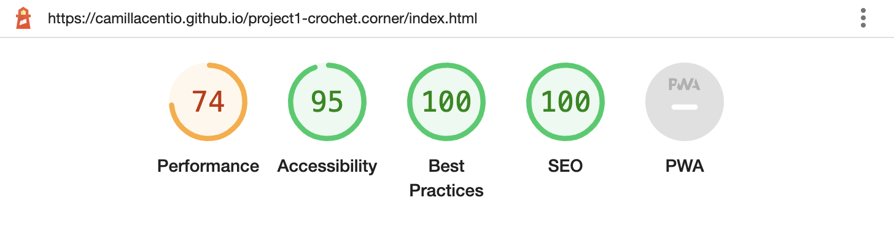

<h2 align="center">Project 1 - Crochet Corner</h2>

My first project with Code Institute in HTML and CSS. 

 
<a href="https://camillacentio.github.io/project1-crochet.corner/">View Demo Website</a>

# Crochet Corner 
Crochet Corner is a website where we crocheters gather to crochet together. We offer meetings over Google Meet.

Users on the page will be able to find information about what we do and how, you will also find links to social media where there are more crocheters and also a link to a pattern library with free patterns. You can sign up for our newsletter where we will provide information about various meetings and also in the future that users themselves can set up a meeting where others can join, because not everyone can attend the already fixed times.

The website is aimed at crocheters who feel that it is a bit boring to sit at home all by themselves and crochet but may not have the opportunity to sit down in a cafe with others and crochet.

# Features
### Navigation 
- At the top of the page you will find a menu on the right and a simple logo on the left. The logo links you to the homepage. 
- The menu at the right links you to our gallery and our signup page where you also find a box with our next meetings. 
- The logo is in black with a pink background and easy to read. 
The navigation is clear and easy for users to navigate through.

### Header
- In the header you will find our navigation menu and logo. 

- In our header you will also see a beautiful spring/easter picture with a cup of yarn, taken by the creater herself.

### Information 
- Under our header you will find some information. 

- You will also find some links to instagram, youtube and a link to a pattern gallery where you can find free patterns. 

### Sign up
- In our sign up page you will find a signup box where you can sign up for our newsletter. 

- You will also find a box with our next meeting and upcoming meetings. 

### Footer

- In our footer you find social links to Facebook, Instagram, Etsy and Pinterest. 
- There is also a Copyright and a email if you want to contact the owner of the page. 

# Testing 
- I have tested the website in Chrome, Firefox and Safari and they all works. 
- The site is responsive and looks good in different types of screens sizes. 
- I have checked that all the links in the menu work and also the link in the logo.

# Bugs

- Have not found any bugs. 

# Validator
#### HTML
- Did not show any problems when I did run it in W3C validator. 

#### CSS
- Did not show any problems in W3C validator. 

#### Lighthouse
- Accessibility is okey for this project. 

# Credit
 - Pictures on the page is mostly taken by my self, except for 1 picture on the sign up page. 
 - Logos is taken from: [Font-awesome] (https://fontawesome.com/)
 

